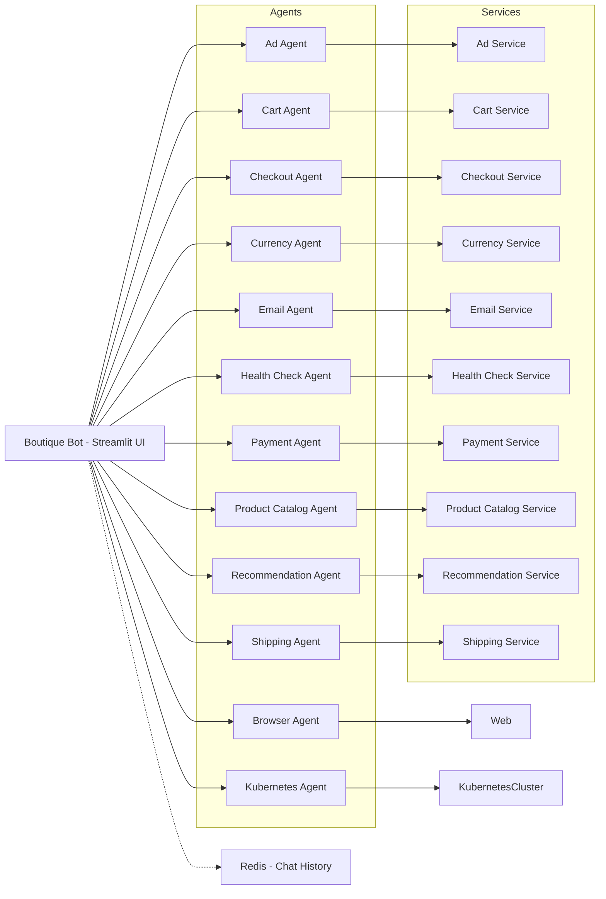

# Boutique Bot

AI assistant for the online boutique microservices demo app.

Boutique Bot is an AI-powered chatbot designed to assist users of the online boutique microservices demo application. It leverages Google's generative AI to provide a conversational interface for interacting with the boutique's services.

## Features

- **Conversational Interface:** Chat with the bot to perform various actions within the boutique.
- **E-commerce Functionality:** Interact with services for product catalog, shopping cart, checkout, and more.
- **Extensible Agent System:** The bot is built with a system of agents that can be extended to support new functionality.
- **Microservices Integration:** Communicates with the boutique's microservices via gRPC.
- **Streamlit UI:** A simple and intuitive user interface built with Streamlit.

## Architecture

The Boutique Bot is part of a larger microservices architecture. The bot itself is a Python application that uses a gRPC client to communicate with the various microservices of the boutique. It uses Redis to store chat history.

The following diagram illustrates the architecture of the system:



The main components are:
- **Streamlit UI:** The user interface for the chatbot.
- **Boutique Bot Application:** The core Python application that handles chat logic and agent orchestration.
- **Agents:** A collection of specialized agents that handle different tasks (e.g., cart management, product search).
- **gRPC Clients:** Used to communicate with the boutique's microservices.
- **Redis:** Used for storing chat history.

## Getting Started

### Prerequisites

- Python 3.12+
- [Docker](https://docs.docker.com/get-docker/)
- [uv](https://github.com/astral-sh/uv)

### Installation

1. **Clone the repository:**
   ```bash
   git clone https://github.com/your-username/boutique-bot.git
   cd boutique-bot
   ```

2. **Create a virtual environment and install dependencies:**
   ```bash
   uv venv
   source .venv/bin/activate
   uv pip install -r requirements.txt
   ```

### Running the application

1. **Start the Redis container:**
   ```bash
   docker-compose up -d redis-chat-history
   ```

2. **Run the Streamlit application:**
   ```bash
   streamlit run src/main.py
   ```

## Deployment

The application is designed to be deployed on Kubernetes. The `kubernetes-manifests` directory contains the necessary Kubernetes manifests for deploying the bot and its dependencies.

The `scripts/deploy_to_kubernetes.sh` script can be used to deploy the application to a Kubernetes cluster.

## Testing

The `scripts` directory contains scripts for testing the services:
- `test_all_svcs.sh`: Tests all services.
- `test_one_svc.sh`: Tests a single service.
